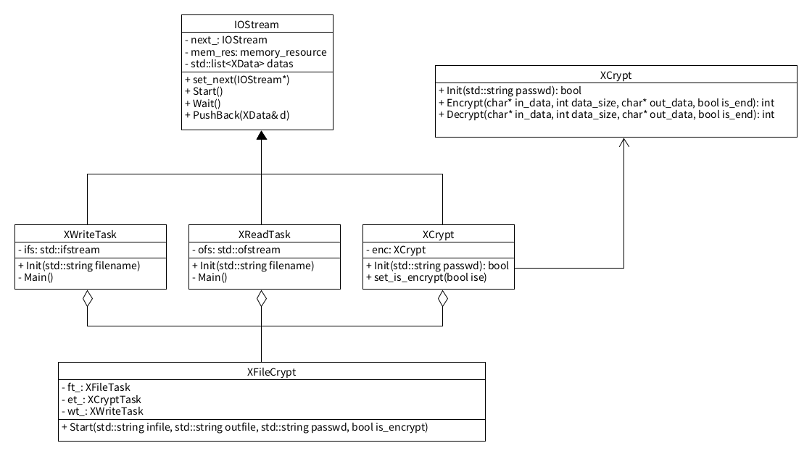

# 基于内存池的多线程批量文件加解密程序

## 环境要求

gcc13.2(支持C++17即可)\
openssl

## 编译

``` bash
cd build
cmake .. -DCMAKE_TOOLCHAIN_FILE=./build/Release/generators/conan_toolchain.cmake -DCMAKE_BUILD_TYPE=Release
```

## 要求

多线程技术

加解密技术，openssl库

设计模式: 观察者模式、单件模式

智能指针、内存池、线程技术

## 程序架构



### 模块功能

#### 1. XCrypt 加解密类

需要考虑的问题: 加解密结尾处的填充

#### 2. IOStream

线程基类、责任链模式、多线程数据传递、内存池注入和空间管理

#### 3. XReadTask

文件读取类、继承IOStream

读取文件，发送给下一个责任链，需要告诉下一个责任链任务结束

#### 4. XCryptTask

加解密处理线程、继承IOStream

接收XReadTask传递数据

#### 5. XWriteTask

写入文件现场、继承IOStream

接收XEncryptTask发送的加解密数据

#### 6. XFileEncrypt

任务组合 组合 文件读取=>加密=>写入文件

#### 7. XFileDecrypt

任务组合 组合 文件读取=>解密=>写入文件

#### 8. crypt_file

入口文件、接收用户输入 源文件目录和输出目录

批批量处理文件加解密任务

### 关于tests

tests中的文件是根据功能线性添加的，添加顺序与tests中的CMakeLists中构建项目的顺序相关

以下列出开发相关的测试列表：

``` 
Test_crypt_file.cpp     构建加密的底层算法调用测试
Test_read_task.cpp      构建读取文件的任务测试
Test_create_pool.cpp    构建创建线程池的测试
Test_chain_res.cpp      构建责任链的测试
Test_run_task1.cpp      构建加密任务的测试
Test_write_task.cpp     构建写入文件的任务测试
Test_run_decrypt.cpp    构建加密文件、写入文件、解密文件的任务测试
Test_run_filecrypt.cpp  构建封装功能的file的任务测试
```

## 通过该项目开发的工具

这个项目位置在tool文件夹中，并将其生成为单独的exe文件.
